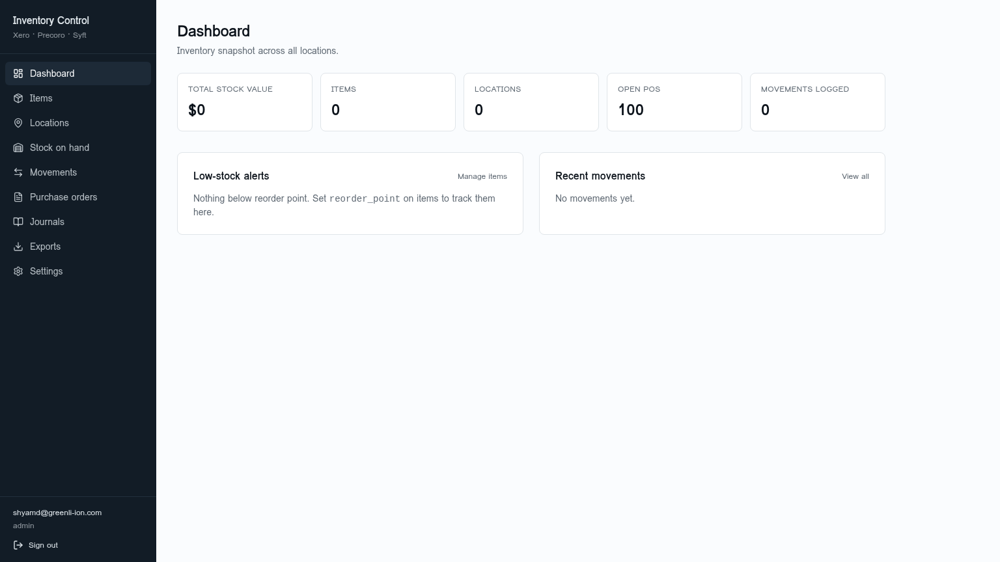
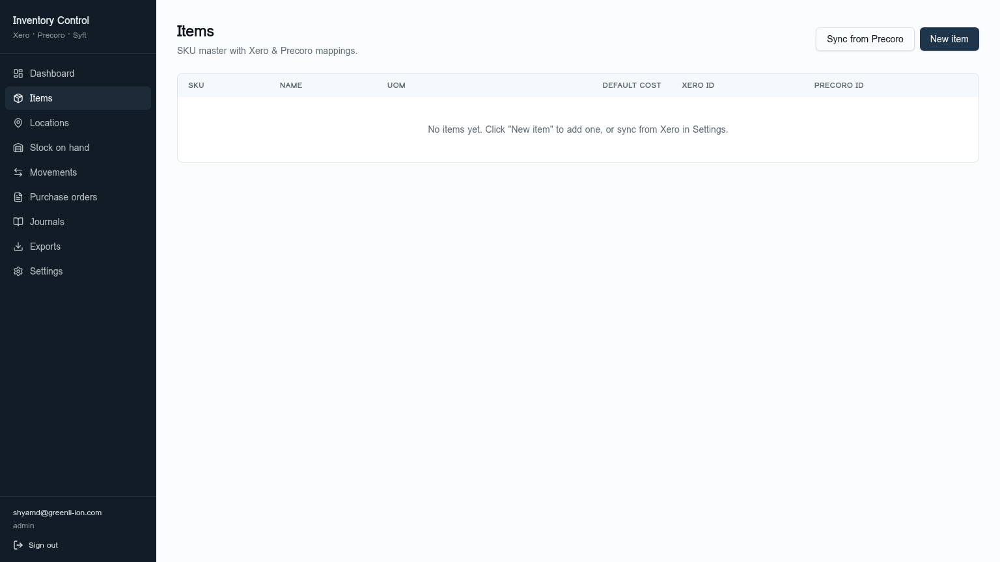
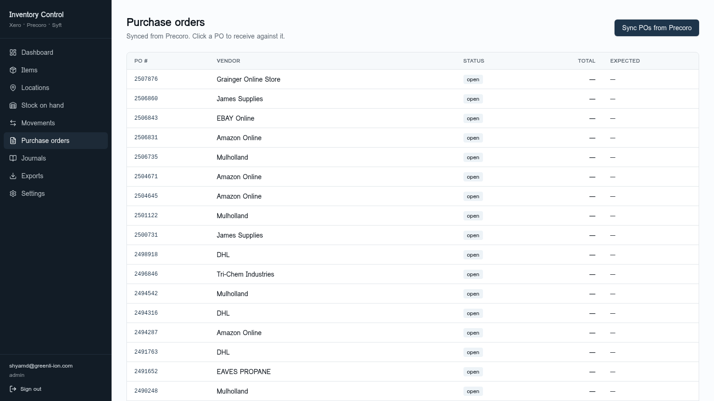
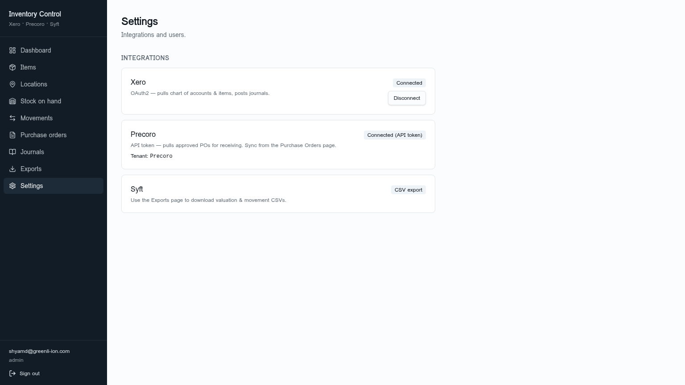

# Inventory Control System

A multi-location inventory, purchase order, and stock-movement system with
native integrations for **Xero** (accounting), **Precoro** (procurement),
and **Syft** (CSV analytics export).

Built on TanStack Start (React 19 + Vite 7) with a managed Postgres backend
(Supabase via Lovable Cloud). Designed to be deployed to Cloudflare Workers,
Azure Static Web Apps, or any Node-compatible host.

---

## Features

- **Dashboard** — total stock value, item count, locations, open POs, movement log
- **Items master** — SKU catalogue with UoM, default cost, Xero & Precoro mappings
- **Locations** — multi-warehouse / multi-bin support
- **Stock on hand** — per-location quantity, valuation, low-stock alerts
- **Movements** — append-only stock-movement ledger (receipts, issues, transfers, adjustments)
- **Purchase orders** — synced from Precoro, receivable line-by-line into stock
- **Journals** — Xero journal staging (PO receipts, COGS, adjustments)
- **Exports** — Syft-compatible CSVs (valuation, movements, trial balance feed)
- **Settings** — OAuth2 to Xero, API token for Precoro, role-based access

## Screenshots

### Dashboard


### Items master


### Purchase Orders (synced from Precoro)


### Integrations & Settings


---

## Tech Stack

| Layer        | Choice                                                   |
| ------------ | -------------------------------------------------------- |
| Framework    | TanStack Start v1 (React 19, file-based routing, SSR)    |
| Build        | Vite 7                                                   |
| Styling      | Tailwind CSS v4 + shadcn/ui                              |
| Data         | TanStack Query                                           |
| Backend      | Supabase (Postgres + Auth + RLS)                         |
| Server logic | TanStack `createServerFn` (Precoro, Xero, Syft adapters) |
| Hosting      | Cloudflare Workers (default) / Azure / Node              |
| Package mgr  | Bun                                                      |

---

## Local Development

```bash
# 1. Install
bun install

# 2. Configure env (see .env.example)
cp .env.example .env
# fill in VITE_SUPABASE_URL, VITE_SUPABASE_PUBLISHABLE_KEY, etc.

# 3. Run
bun run dev          # http://localhost:5173

# 4. Build
bun run build
```

### Required secrets (runtime, server-side)

| Name                         | Used by                                |
| ---------------------------- | -------------------------------------- |
| `SUPABASE_URL`               | server functions                       |
| `SUPABASE_PUBLISHABLE_KEY`   | server functions (user-scoped)         |
| `SUPABASE_SERVICE_ROLE_KEY`  | admin server routes (webhooks, cron)   |
| `PRECORO_API_TOKEN`          | `src/lib/precoro.functions.ts`         |
| `XERO_CLIENT_ID`             | Xero OAuth2                            |
| `XERO_CLIENT_SECRET`         | Xero OAuth2                            |
| `XERO_REDIRECT_URI`          | Xero OAuth2                            |
| `AZURE_FOUNDRY_API_KEY`      | (optional) AI features                 |

Build secrets (set in workspace, not `.env`): none required by default.

---

## Deployment

See [`docs/DEPLOYMENT.md`](docs/DEPLOYMENT.md) for full instructions covering:

- **Lovable** (fastest, one-click publish)
- **Cloudflare Workers** (default target)
- **Azure Static Web Apps + Functions**
- **Azure App Service** (full Node SSR)
- **Docker / Azure Container Apps**

---

## Repository Mirrors

This project is mirrored across three remotes:

| Remote        | URL                                                  |
| ------------- | ---------------------------------------------------- |
| `origin`      | `https://github.com/icohangar-ops/inventory-control.git`  |
| `github2`     | `https://github.com/icohangar-ops/inventory-control.git` |
| `codeberg`    | `https://codeberg.org/ShyamDesigan/inventory-control.git` |

Push to all three at once:

```bash
# macOS / Linux / Git Bash
./scripts/push-all.sh

# Windows PowerShell
.\scripts\push-all.ps1
```

See [`docs/GIT_MIRRORS.md`](docs/GIT_MIRRORS.md) for PAT setup.

---

## License

Proprietary — © Shyam Desigan / Greenli-Ion.